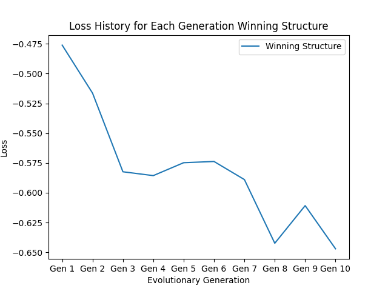

# Diffmpm Tower
> ME 495 Artifical Life Final Project
>
> Author: Sairam Umakanth

This repository contains all the information about the diffmpm tower project for ME 495: Artificial Life, including code and all deliverables required for the project, including a link to a YouTube video explaining the project in detail. This project was based on the original diffmpm example provided by difftaichi (https://github.com/taichi-dev/difftaichi). Modifications were made to the original diffmpm structure to make it capable of having multiple legs and layers of various leg widths and leg heights. The structure was also modified around Generation 8 to have structural defects which will be covered in more detail further in the README. Ten generations of evolutions were conducted with each generation having a population of 10. 


## Organization

This repository contains the following files with the following functions:

- `diffmpm_tower.py`: Main source code containing all information required to run and simulate one generation of the diffmpm tower
- `diffmpm_chart.py`: Plots loss of all generations stored in file manually
- `diffmpm_tower.md`: Contains history of all best performing structure of each generation and loss history plots for each generation
- `combine_videos.py`: Combines videos from all children of one generation into a single video
- `record.py`: Combines all images from one visualization of simulation into a video
- `diffmpmtower_gif.gif`: Gif shown above

## Code Functionality

`diffmpm_tower.py` is based on the original diffmpm example provided by difftaichi as mentioned above. The original diffmpm example consists off the creation of a soft structure that comprises of one rigid rectangular block, and two softer legs that can be actuated and act as muscles to the structure. A sinusoidal wave is provided to actuate the structure and the amplitude of actuation is computed off a learning method employed within the Taichi framework, using gradient descents. The organism also learns to walk to a target location, with a loss function capturing how effectively the organism is able to achieve (or come close to the goal). The `diffmpm_tower.py` has some added modifications to make it capable of more functionalities.

Adding onto the single body and two legs, the number of legs and layers (owing to the name diffmpm tower) can be randomly chosen within the simulation. Other parameters that can be randomly chosen are the leg widths and leg heights, the limits to leg width and leg height scaling inversely with the number of legs and number of layers respectively. Another important characteristic of the body introduced in Generation 8 is the presence of defects within the body, or as labeled in the code `discrepancies`. These defects are localized sub-regions where a rigid particles or softer muscle actuation particles populate the region over the existing particle. An example of a defect can be seen in the gif above. The positions and size of these defect regions can also be randomly generated.

An outer loop was added on top of the existing simulation loops of the original `diffmpm.py` was added, which creates a population of ten structures of the randomly generated evolution parameters discussed above. For each generation, a few evolution parameters were held constant from the parent of the generation (best performing structure of the previous generation or historical best), and all other parameters are randomly generated to leverage performance benefits from different genomes. To run one generation of children, the code has to be run once. To mutate the organism, from the best performing structure, a few desired parameters are held constant in the new generations and all the other parameters are randomized as can be seen in lines 497-514, shown below. Unfortunately, this process had to be manually done from each generation to generation, but still serving as a great proof of concept for artificially simulated evolutions of artificial life.  

```python
            legs =  2 #np.random.randint(2, 6)
            layers = np.random.randint(1, 4)
            leg_width = 0.14 #0.01 + np.random.rand() * (0.3/(legs) - 0.01)
            leg_height = 0.01 + (np.random.rand() * (0.1 - layers * 0.01))
            robot(scene, legs, layers, leg_width, leg_height)
            # Add random modifications.
            discrepencies = 4
            discrepancy_params = []
            for i in range(discrepencies):
                x1 = 0.1 + np.random.rand() * 0.3
                x2 = 0.1 + np.random.rand() * 0.3
                y1 = 0.03 + np.random.rand() * 0.2 * layers
                y2 = 0.03 + np.random.rand() * 0.2 * layers
                w1 = np.random.rand() * 0.1
                w2 = np.random.rand() * 0.2
                discrepancy_params.append((x1, y1, w1, x2, y2, w2))
                scene.modify_material_properties(x1, y1, w1, w1, "circle", -1)
                scene.modify_material_properties(x2, y2, w2, w2, "circle", 3)
```

The actuation remains sinusoidal as it was shown previously (ME 495 Lab 4) that this is still the best open-loop control method of actuation. Additionally, the loss function was slightly modified to include the Y-direction distance traversed by the object. This was done to compare if the structure prefered to grow vertically, or find more agressive methods of traversing horizontally to achive its goal. This process was repeated for 10 generations and the results are discussed below. 

## Results

It was found that the structure preferred to evolve in the middle ground of horizontality and verticality by converging at 2 layers, but 2 relatively shorter layers compared to the maximum height the legs could have been. The tower also evolved to converge at 2 thick legs compared to a maximum of 5 legs, which gave it a lot of structural resilience. For the characterization of discrepancies, it was found that the structure performed best when there were large soft muscle defects localized around the forward legs, giving the structure an ability to take larger steps in that direction. A surprising but pleasant surprise was how resilient the structure became, with the absence of any fractures or breaking after the fourth generation of children. To learn more about the evolutionary method used for these structures, please refer to the YouTube video attached later in this README. A graph charting loss of the best performing structure can be seen below. 



## YouTube Video (click on thumbnail)

[](https://www.youtube.com/watch?v=ei0TkFdqHJA)


