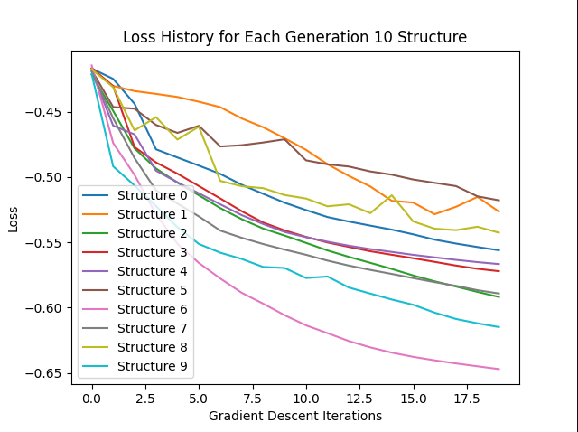

# Documentation for diffmpm_tower evolution

For each generation, change video title names and plot title names and change which parameter you are modifying

Number of children per generation: 10
Number of parents per generation: 1

## Generation 1: (Parent: Original diffmpm) Vary legs and leg width, layers = 1


```json
    {
        "generation_iteration": 5,
        "layers": 1,
        "legs": 4,
        "leg_width": 0.051047892965566985,
        "leg_height": 0.1,
        "discrepancies": 0,
        "discrepancy_params": [],
        "weights": [
            [
                -0.17002957666714463,
                -0.11233772831663626,
                0.18731729555299878,
                0.09877922066580706
            ],
            [
                -0.24464810139161722,
                0.0065570998174598275,
                0.24959992713495807,
                -0.012925425233065908
            ],
            [
                -0.006455873003110645,
                0.12219555398865979,
                0.018226539672399848,
                -0.13009632377381253
            ],
            [
                0.040429884244795045,
                0.0922505779013547,
                -0.028734262493112506,
                -0.1007036402099117
            ],
            [
                -0.016364904456781834,
                0.010252596527776806,
                -0.007641519200425645,
                -0.015783496280710647
            ],
            [
                0.014038653778317286,
                -0.005816233231317071,
                0.020793825795229585,
                0.01741077128480315
            ],
            [
                0.002216297702051014,
                0.007523185086146556,
                -0.0072613014360200755,
                0.0011087997309770293
            ],
            [
                -0.018730186455901732,
                -0.008605362979399778,
                0.007221763164398824,
                -0.0029235934782631612
            ]
        ],
        "bias": [
            -0.24010855589444258,
            0.06017359551186819,
            -0.027864385822126924,
            0.07052681627732833,
            -0.009886783074433171,
            -0.001588594416380376,
            0.011420428033427259,
            0.018922324759446964
        ],
        "best_loss": -0.476104647850886
    },
```

## Generation 2: Vary layers and leg height, legs and leg width from predecessor


```json
    {
        "generation_iteration": 3,
        "layers": 2,
        "legs": 4,
        "leg_width": 0.051047892965566985,
        "leg_height": 0.057718790035734754,
        "discrepancies": 0,
        "discrepancy_params": [],
        "weights": [
            [
                -0.11622471868688126,
                0.09554718518735228,
                0.1376759046633478,
                -0.11764500889606865
            ],
            [
                -0.08263824051085586,
                -0.05032722969498422,
                0.07605128150684173,
                0.024970463607401037
            ],
            [
                0.07916976567591087,
                -0.11697614224164173,
                -0.0832792220540145,
                0.12419823843761911
            ],
            [
                0.2124437405996142,
                -0.20951055817019396,
                -0.19744738668878992,
                0.19957504046370922
            ],
            [
                -0.004719335174096321,
                0.0036476678767510206,
                -0.007796364893372297,
                0.0016279577984006108
            ],
            [
                -0.005416292517990118,
                0.009360505681633255,
                -0.007494161611339637,
                -0.006488475542370824
            ],
            [
                0.0014292192956089325,
                0.009178572402245674,
                0.002323470967498659,
                0.006910281795381813
            ],
            [
                0.01574619363667093,
                0.009721950668032244,
                0.011392132735241853,
                -0.01058972674051196
            ]
        ],
        "bias": [
            -0.15685208201101775,
            -0.042297774893539156,
            0.0849286987578171,
            0.12304236048322816,
            -5.740708090538091e-05,
            -0.0005677561757779814,
            0.015041230874554294,
            -0.0006906768729332268
        ],
        "best_loss": -0.5163953955998953
    },
```

## Generation 3: Vary legs and leg width, layers and leg height from predecessor


```json
{
        "generation_iteration": 0,
        "layers": 2,
        "legs": 2,
        "leg_width": 0.13993498775300625,
        "leg_height": 0.057718790035734754,
        "discrepancies": 0,
        "discrepancy_params": [],
        "weights": [
            [
                -0.09630324502431688,
                0.26224011840755146,
                0.08149469692188706,
                -0.25472790543389684
            ],
            [
                0.36243433972860284,
                -0.35015487972263865,
                -0.35777147233762835,
                0.35717840914158716
            ],
            [
                0.010544482839235083,
                0.004152132329916638,
                -0.009022721746914998,
                -0.022587333622025144
            ],
            [
                -0.0013007207549369268,
                0.005274869786423292,
                -0.005776324950555634,
                -0.0037390597552964216
            ]
        ],
        "bias": [
            -0.11724540249362222,
            0.024184534721343295,
            -0.00013974724105124926,
            -0.023676050311766478
        ],
        "best_loss": -0.5823875085100336
    },
```

## Generation 4: Vary layers and leg height, legs and leg width from predecessor


```json
{
        "generation_iteration": 8,
        "layers": 2,
        "legs": 2,
        "leg_width": 0.13993498775300625,
        "leg_height": 0.05629517073980425,
        "discrepancies": 0,
        "discrepancy_params": [],
        "weights": [
            [
                -0.09509113935873666,
                0.2394039897869061,
                0.1067855299286504,
                -0.25979743188277077
            ],
            [
                0.38280167825987876,
                -0.3610630303676001,
                -0.3807206595515146,
                0.33011460526267944
            ],
            [
                0.014108690451978196,
                -0.014147261832914182,
                -0.00784112556403124,
                -0.01084988453957843
            ],
            [
                -0.002960350338573298,
                -0.003741641676002202,
                -0.006963513381604128,
                0.003350863543607849
            ]
        ],
        "bias": [
            -0.12472043971522834,
            0.00404884453353789,
            -0.0018744305073857014,
            -0.0005435282147130007
        ],
        "best_loss": -0.5856097577308156
    },
```

## Generation 5: Vary legs and leg width, layers and leg height from predecessor

No improvement. Max loss still Gen 4


```json
    {
        "generation_iteration": 3,
        "layers": 2,
        "legs": 4,
        "leg_width": 0.07231678739271982,
        "leg_height": 0.05629517073980425,
        "discrepancies": 0,
        "discrepancy_params": [],
        "weights": [
            [
                -0.1525558789484955,
                0.28609249886092397,
                0.16341214504711227,
                -0.2937546749896504
            ],
            [
                -0.011507634871069436,
                0.04649725104885554,
                0.025580904446334856,
                -0.025060793373088978
            ],
            [
                0.16390287184878546,
                -0.11061389801519712,
                -0.14446775311254326,
                0.12626540634060932
            ],
            [
                0.31983379111942484,
                -0.27119263556555595,
                -0.311479149693563,
                0.26415597405651725
            ],
            [
                0.00548960492801,
                -0.007659151404261469,
                0.007172019658880417,
                0.006568834570793165
            ],
            [
                0.00812562611484708,
                -0.009613132255221368,
                -7.807276299612344e-05,
                0.0021157269563597592
            ],
            [
                0.0028225451573104863,
                0.011635878824942856,
                0.006944194713345108,
                0.0003275032778800459
            ],
            [
                0.00968177416721611,
                0.00015988793843767804,
                0.0023266771283901875,
                0.007581445649852628
            ]
        ],
        "bias": [
            -0.10299968410326453,
            -0.025214512488838638,
            0.015667398922743138,
            -0.04996553606439351,
            0.0014691805299184937,
            -0.010996696184176633,
            0.006079232062845044,
            -0.010588193152060228
        ],
        "best_loss": -0.5747788693638014
    },
```

## Generation 6: Vary leg width and height, legs and layers from predecessors (this time its Generation 4)

No improvement. Max loss still Gen 4


```json
    {
        "generation_iteration": 1,
        "layers": 2,
        "legs": 2,
        "leg_width": 0.13466531234724516,
        "leg_height": 0.060536839646933946,
        "discrepancies": 0,
        "discrepancy_params": [],
        "weights": [
            [
                -0.021814834545880422,
                0.20896680434339376,
                0.05621353356608344,
                -0.22454626220815144
            ],
            [
                0.2787782016642739,
                -0.4000137932717493,
                -0.28994050128852683,
                0.3969641526669214
            ],
            [
                0.0002500404956714512,
                0.006497134643285582,
                -0.0009968859125481478,
                0.005002986635505987
            ],
            [
                -0.0032583738889687746,
                0.002809710650281432,
                -0.00759350830546617,
                -0.0058661115136582455
            ]
        ],
        "bias": [
            -0.13529062996791508,
            0.08362367297932806,
            -0.0016802914326453683,
            -0.006650147157507389
        ],
        "best_loss": -0.5737551336266279
    },
```

## Generation 7: Vary legs and layers, keep legs * width and layers * height constant


```json
    {
        "generation_iteration": 8,
        "layers": 2,
        "legs": 2,
        "leg_width": 0.13993498775300625,
        "leg_height": 0.05629517073980425,
        "discrepancies": 0,
        "discrepancy_params": [],
        "weights": [
            [
                -0.10604195008214053,
                0.2702335069595257,
                0.09129589376278782,
                -0.2646018154168387
            ],
            [
                0.3824304127218506,
                -0.35767393119276436,
                -0.39027632846618554,
                0.34766485904371125
            ],
            [
                0.003205588098850651,
                0.018916935567959297,
                -0.021879724166092962,
                -0.0022899577916534494
            ],
            [
                -0.02374056215426346,
                -0.0060975196076749295,
                -0.021853711591815404,
                0.0013881987429721627
            ]
        ],
        "bias": [
            -0.1095025761363294,
            0.010000404197664776,
            -0.011238164840564011,
            -0.0015117065890242999
        ],
        "best_loss": -0.5889408824491154
    },
```

## Generation 8: Introduce discrepancies: Varying number of discrepancies


```json
    {
        "generation_iteration": 9,
        "layers": 2,
        "legs": 2,
        "leg_width": 0.13993498775300625,
        "leg_height": 0.05629517073980425,
        "discrepancies": 1,
        "discrepancy_params": [
            [
                0.22661909853243745,
                0.21549569096406415,
                0.03342571492465076,
                0.37575698104188593,
                0.15533501013183895,
                0.16549789815616123
            ]
        ],
        "weights": [
            [
                -0.018342638925024884,
                0.2774118816747701,
                0.025032010419118865,
                -0.291773450234946
            ],
            [
                0.23306693944466536,
                -0.0623373697493216,
                -0.2522175512871703,
                0.06497684784743069
            ],
            [
                0.008488714197126468,
                -0.002820290312467864,
                -0.0023343482238681683,
                -0.016898926817543677
            ],
            [
                0.36721847125532986,
                -0.3173142577666674,
                -0.3720358148169741,
                0.3154503168880066
            ]
        ],
        "bias": [
            -0.21387203843530503,
            0.1051323208503361,
            -0.0028131257308379866,
            -0.0071354855074283316
        ],
        "best_loss": -0.6423607066360082
    }
```

## Generation 9: Vary discrepancy size for one number of discrepancy number

No improvement from last generation


```json
    {
        "generation_iteration": 4,
        "layers": 2,
        "legs": 2,
        "leg_width": 0.13993498775300625,
        "leg_height": 0.05629517073980425,
        "discrepancies": 2,
        "discrepancy_params": [
            [
                0.2831052843999339,
                0.10611751118426446,
                0.057839184369225874,
                0.3723040497437836,
                0.155697379203493,
                0.010771915611429385
            ],
            [
                0.24975169819094753,
                0.09033743845461478,
                0.08258660434892223,
                0.3327912360538873,
                0.28289190244566653,
                0.15508690317808593
            ]
        ],
        "weights": [
            [
                -0.07126353296327498,
                0.31121432221962253,
                0.05256489334339042,
                -0.31298637021990394
            ],
            [
                0.33144722858476616,
                -0.30808027071802524,
                -0.31017261632014614,
                0.29340594460980257
            ],
            [
                -0.002974873045418471,
                -0.006575863312775593,
                -0.0036976842065349685,
                -0.007920454484739383
            ],
            [
                0.2708685045844959,
                -0.21817184046451113,
                -0.253808927936061,
                0.21039991743464023
            ]
        ],
        "bias": [
            -0.12529406029779286,
            0.011222290575553056,
            0.004973782021085222,
            0.008858282981708706
        ],
        "best_loss": -0.6107989444556514
    },
```

## Generation 10: Vary discrepancy size for one number of discrepancy value



```json
    {
        "generation_iteration": 6,
        "layers": 2,
        "legs": 2,
        "leg_width": 0.13993498775300625,
        "leg_height": 0.05629517073980425,
        "discrepancies": 4,
        "discrepancy_params": [
            [
                0.378784508202063,
                0.19394524821480982,
                0.08365834453256069,
                0.3508919245812402,
                0.29556934188433837,
                0.12425013506043825
            ],
            [
                0.2023089510291093,
                0.3297717941486862,
                0.03207411550716651,
                0.26847343657541434,
                0.36147069185962466,
                0.08328047485016923
            ],
            [
                0.13257212472059182,
                0.30283716602848043,
                0.07974218385465501,
                0.3633804441698797,
                0.08636401573387881,
                0.1667079483773809
            ],
            [
                0.19893163389013524,
                0.10582656135579224,
                0.065834336637961,
                0.24924471624593927,
                0.3669335546256153,
                0.03759929819702701
            ]
        ],
        "weights": [
            [
                -0.0018552419503065644,
                0.35765574483120893,
                0.0066891374783971756,
                -0.35660429610535527
            ],
            [
                0.09478215140270212,
                0.002023224576746147,
                -0.10185520170988557,
                -0.0008918528931759224
            ],
            [
                0.01379802734996175,
                0.00716370820553075,
                0.004401306825157474,
                -0.012392956662774339
            ],
            [
                0.3650685900398265,
                -0.3833226508895394,
                -0.35537535673959675,
                0.3934761049130804
            ]
        ],
        "bias": [
            -0.20157555987405085,
            0.0912181368952272,
            -0.016126074694021372,
            0.06381843517356758
        ],
        "best_loss": -0.6470236311413643
    },
``` 


